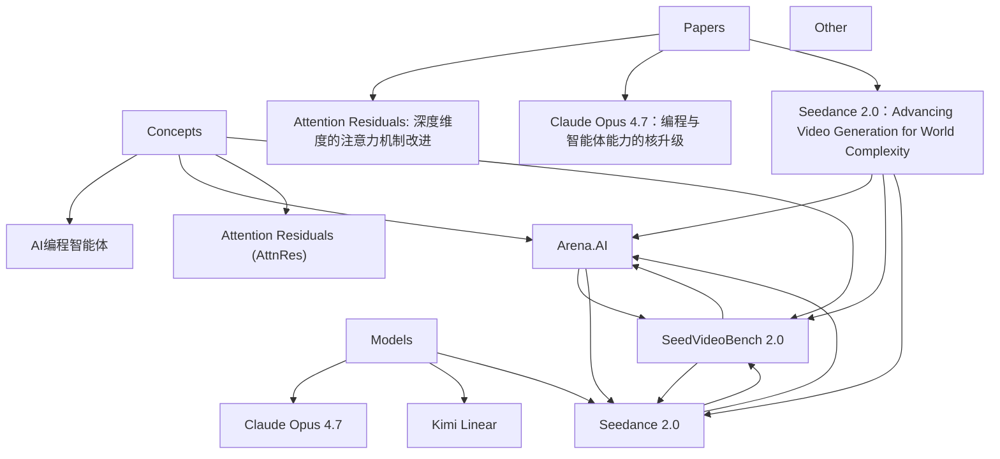

# 🧠 AI 技术栈个人知识库 (LLM-Wiki)

欢迎来到基于 **Trae + GitHub** 维护的个人 AI 知识库。这里是我关于人工智能、大语言模型、推理框架等核心技术的知识网络。

*注：本知识库由 Trae 作为智能图书管理员自动读取 `raw/` 目录中的原始资料并持续维护。*

---

## 📚 目录大纲

### 1. 核心概念 (Concepts)
*这里收录了 AI 领域的关键术语和理论机制。*
- [SeedVideoBench 2.0](./concepts/seedvideobench-2.0.md)
- [Arena.AI](./concepts/arena-ai.md)
- [Attention Residuals (AttnRes)](./concepts/attention-residuals.md)
- [AI编程智能体](./concepts/ai-programming-agents.md)
- [混合注意力架构（Hybrid Attention）](./concepts/hybrid-attention.md)

### 2. 模型解析 (Models)
*各大模型的技术报告精读与架构拆解。*
- [Seedance 2.0](./models/seedance-2.0.md)
- [Kimi Linear](./models/kimi-linear.md)
- [Claude Opus 4.7](./models/claude-opus-4-7.md)
- [DeepSeek-V4](./models/deepseek-v4.md)

### 3. 框架与工具 (Frameworks)
*训练、推理、部署、Agent 构建等生态工具。*
- *(等待 Trae 录入第一篇框架...)*

### 4. 论文研读 (Papers)
*重要学术文献的核心观点提取。*
- [Seedance 2.0：Advancing Video Generation for World Complexity](./papers/seedance-2.0.md)
- [Attention Residuals：深度维度的注意力机制改进](./papers/attention-residuals.md)
- [Claude Opus 4.7：编程与智能体能力的核升级](./papers/claude-opus-4-7.md)
- [DeepSeek-V4：百万Token上下文的效率革命](./papers/deepseek-v4.md)

### 5. 对比与洞察 (Comparisons)
*不同技术路线、模型的优劣势对比分析。*
- *(等待 Trae 录入第一篇对比...)*

---
## 🗺️ 知识图谱 (Mermaid)

<!-- GRAPH:START -->

<!-- GRAPH:END -->

*上次由 Trae 自动更新于：2026-04-22*
